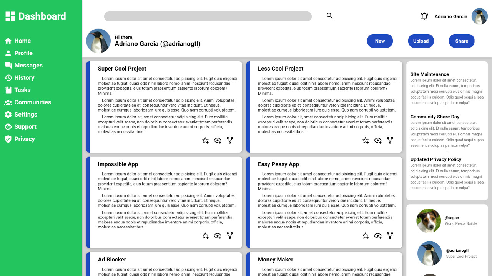

 

  

<h3 align="center">Admin Dashboard | The Odin Project</h3>

  

    As you expect, it's a dashboard
     
     
    <a href="https://adrianogtl.github.io/top-admin-dashboard/">View demo 👀</a>
    &nbsp;&nbsp;&nbsp;
    <a href="https://www.theodinproject.com/">The Odin Project 📚</a>

  

## 🎯 About

- This project is part of the Intermediate HTML and CSS Course from The Odin Project's Full Stack JavaScript path
- Assignment [here](https://www.theodinproject.com/lessons/node-path-intermediate-html-and-css-admin-dashboard#assignment)

## 📝 License

Distributed under the MIT License. See [LICENSE](LICENSE) for more information.

## ♥️ Acknowledgments

- Icons from [Pictogrammers](https://pictogrammers.com/)

<a href="#readme-top">Back to top ⬆️</a>

